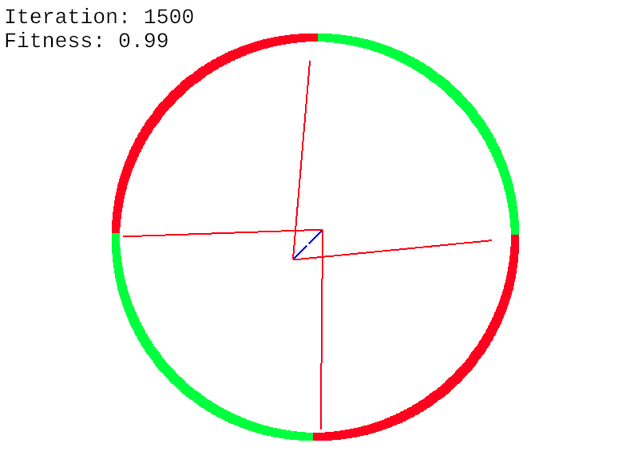

# MSc Thesis Code

This repository contains the code for my MSc thesis on neuroevolution.
It is a framework for visualizing and testing different neuroevolution algorithms on benchmark problems.

<!--  -->


## Setup

The framework is written in Rust. To run it, you need to have Rust and Cargo installed on your system. , which you can do by following the instructions on the
[official website](https://www.rust-lang.org/tools/install).

After installing Rust, and cloning the repository, you can build the project by running the following command in the project's root directory:

```bash
cargo build --release
```

This will take care of downloading all the dependencies and building the project. The resultin framework binary will be located in the `target/release` directory as `main`.

## Usage

```
Neuroevolution framework for testing algorithms on benchmark problems.

Usage: main [OPTIONS] <ALGORITHM> <PROBLEM>

Arguments:
  <ALGORITHM>  The algorithm to test [possible values: oneplusonena, bna, neat, cmaes]
  <PROBLEM>    the benchmark problem [possible values: half, quarter, two-quarters, square, cube, xor, pole-balancing, proben1, local-opt]

Options:
  -r, --resolution <RESOLUTION>  Resolution, when applicable [default: 1000]
  -i, --iterations <ITERATIONS>  Number of iterations [default: 500]
  -n, --neurons <NEURONS>        Number of neurons, when applicable [default: 1]
  -g, --gui                      Display visualization
  -f, --file <FILE>              Configuration file
  -o, --output <OUTPUT>          Results output file
  -t, --test-runs <TEST_RUNS>    Number of runs
  -e, --error-tol <ERROR_TOL>    Max fitness tolerance [default: 0.02]
  -s, --stagnation <STAGNATION>  Max stagnation
  -h, --help                     Print help
  -V, --version                  Print version
```

## Examples

To run the BNA algorithm on the Half problem, with 200 iterations and 1 neuron, and to visualize the evolution process, you can run the following command:

```bash
./target/release/main bna half -i 200 -n 1 -g
```

To run the NEAT algorithm on the XOR problem, with 300 iterations, using the configuration file `configs/neat/xor.toml` and saving the results of 100 test runs to the file `results.csv`,
you can run the following command:

```bash
./target/release/main neat xor -i 300 -f configs/neat/xor.toml -o results.csv -t 100
```
